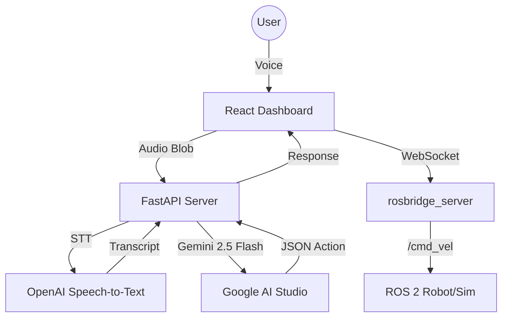

# ROS 2 Navigation Interface


This repository provides an interface for ROS 2 navigation utilizing voice commands. The system processes natural language input via Google's Gemini 2.5 Flash model and visualizes the robot's state on a React-based dashboard.

## System Architecture

The interaction pipeline consists of four primary components:
1. **Frontend**: React application built with Vite, utilizing `MediaRecorder` for audio capture.
2. **Backend**: FastAPI server that coordinates API requests.
3. **Speech processing**: OpenAI Speech-to-Text transcribes the audio input.
4. **Command synthesis**: Gemini 2.5 Flash interpolates the transcript and outputs structured ROS 2 `Twist` messages.
5. **Execution**: The `rosbridge_server` transmits the parsed commands to the ROS 2 Humble environment (Nav2, Cartographer, AMCL).

The system includes a regex-based fallback parser to ensure operational continuity during API service interruptions.



## Installation and Configuration

### Prerequisites
- Ubuntu 22.04 LTS (or WSL2)
- ROS 2 Humble Hawksbill (Desktop Install)
- Node.js (or Bun)
- Python 3.10+

### Setup Instructions

1. **Repository mapping**
   ```bash
   git clone https://github.com/howdoiusekeyboard/ros2_navigation_project.git
   cd ros2_navigation_project
   ```

2. **Environment configuration**
   Populate the backend environment file with required API keys.
   ```bash
   cp backend/.env.example backend/.env
   # Add OPENAI_API_KEY and GEMINI_API_KEY to the .env file
   ```

3. **System initialization**
   Execute the provided bash script to instantiate the simulation, backend server, and frontend dashboard concurrently.
   ```bash
   ./start_robot_dashboard.sh
   ```

4. **Interface access**
   The dashboard hosts on `http://localhost:5173`. A Chromium-based browser is required for full `MediaRecorder` compatibility.

## Operation Guidelines

1. Verify connection state via the dashboard ("Connected to ROS 2").
2. Initiate voice capture utilizing the interface microphone control.
3. Issue spatial or directional commands (e.g., "rotate left 90 degrees", "proceed forward 2 meters", "halt").
4. Alternatively, use the text input field for manual command insertion.

## Project Structure

- `src/`: ROS 2 packages integrating Cartographer and Nav2 configurations.
- `backend/`: Python backend utilizing FastAPI.
- `project/`: React-based interactive dashboard.
- `scripts/`: Operational scripts for initialization and debugging.

## Documentation References

- [SETUP.md](SETUP.md): Comprehensive environment preparation guide.
- [RECOVERY.md](RECOVERY.md): Guidelines for restoring the system from failure states.

## License

This project operates under the MIT License. Reference the [LICENSE](LICENSE) file for exact parameters.