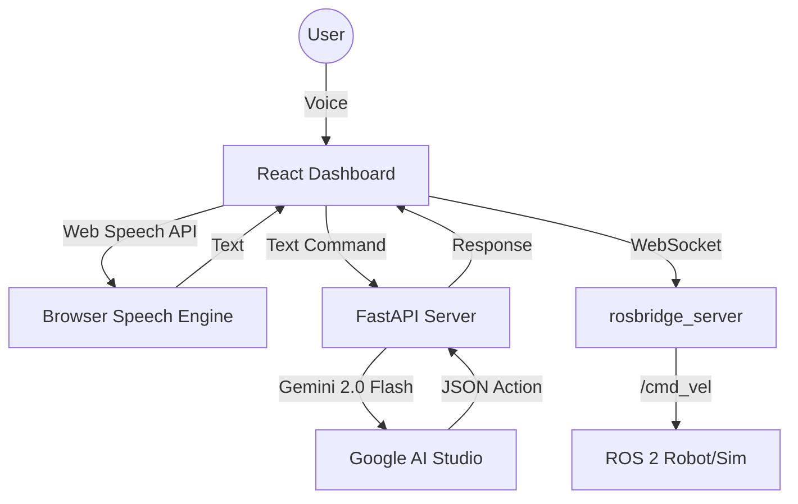

# 🤖 Voice-Controlled ROS 2 Navigation


A modern, voice-activated interface for ROS 2 navigation. Control your robot using natural language commands processed by Google's Gemini 2.0 Flash model, visualized on a real-time React dashboard.

## ✨ Features

- **🗣️ Natural Language Control**: Speak commands like "spin in a circle" or "move forward 2 meters".
- **🧠 AI-Powered Parsing**: Uses Gemini 2.0 Flash to convert speech into structured ROS 2 Twist messages.
- **⚡ Real-time Dashboard**: React-based UI with live feedback, voice transcription, and ROS connection status.
- **🛡️ Robust Architecture**:
    - **Frontend**: React + Vite + Web Speech API
    - **Backend**: FastAPI + Gemini SDK
    - **Robot**: ROS 2 Humble (Nav2, Cartographer, AMCL)
- **🔌 Fallback Mode**: Regex-based command parsing ensures functionality even if the AI API is offline.

## 🏗️ Architecture



## 🚀 Quick Start

### Prerequisites
- **Ubuntu 22.04** (or WSL2)
- **ROS 2 Humble** Desktop Install
- **Node.js** (or Bun) & **Python 3.10+**

### Installation

1.  **Clone the Repository**
    ```bash
    git clone https://github.com/howdoiusekeyboard/ros2_navigation_project.git
    cd ros2_navigation_project
    ```

2.  **Configure API Keys**
    Create a `.env` file in `backend/` with your [Gemini API Key](https://aistudio.google.com/app/apikey):
    ```bash
    cp backend/.env.example backend/.env
    nano backend/.env
    # Add: GEMINI_API_KEY=your_key_here
    ```

3.  **Launch Everything**
    We provide a single script to start the simulation, backend, and frontend:
    ```bash
    ./start_robot_dashboard.sh
    ```

4.  **Access the Dashboard**
    Open **Chrome** or **Edge** (required for Web Speech API) and navigate to:
    [http://localhost:5173](http://localhost:5173)

## 🎮 Usage

1.  **Connect**: Ensure the status indicator shows "Connected to ROS 2".
2.  **Voice Control**: Click the microphone icon and say a command.
    - *"Spin around"*
    - *"Move forward"*
    - *"Stop"*
3.  **Manual Control**: Use the text input to type commands if you prefer.

## 📂 Project Structure

- `src/`: Custom ROS 2 packages (Cartographer, Nav2 config).
- `backend/`: Python FastAPI server for AI processing.
- `project/`: React frontend application.
- `scripts/`: Helper scripts for startup and testing.

## 📚 Documentation

- [**SETUP.md**](SETUP.md): Detailed installation and troubleshooting guide.
- [**RECOVERY.md**](RECOVERY.md): Disaster recovery and backup restoration.

## 🤝 Contributing

Pull requests are welcome! Please read our contributing guidelines before submitting.

## 📄 License

MIT License - see [LICENSE](LICENSE) for details.