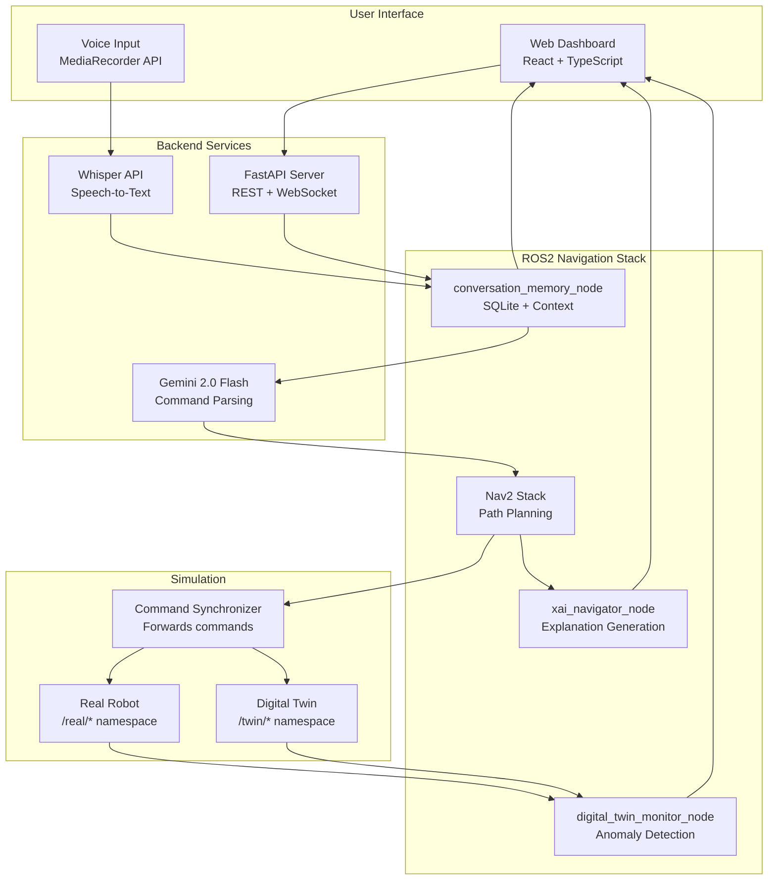

# System Architecture: Intelligent Digital Twin with XAI for HRI

**Version:** 1.0
**Date:** November 2025
**Author:** BITS Pilani Dubai Campus Student
**Supervisor:** Dr. Sujala D. Shetty

---

## High-Level System Overview



---

## Component Architecture

### 1. Conversation Memory Node
**Package:** `conversation_memory_pkg`
**Purpose:** Store dialogue history and inject context into LLM prompts

**ROS2 Interface:**
```yaml
Subscriptions:
  /voice/transcription:
    type: std_msgs/String
    description: Whisper transcription output

  /robot/pose:
    type: geometry_msgs/PoseStamped
    description: Current robot position from AMCL

Publications:
  /conversation/context:
    type: intelligent_twin_msgs/ConversationContext
    description: Context-enriched data for downstream processing

  /conversation/history:
    type: std_msgs/String (JSON)
    description: Serialized conversation history for dashboard
```

**Internal Storage:**
- SQLite database: `~/.ros/conversation_history.db`
- Schema: id, timestamp, user_input, robot_response, location

**Key Functions:**
- `store_turn()` - Save user input and robot response
- `get_context()` - Build context for Gemini prompt
- `publish_context()` - Send context to downstream nodes

---

### 2. XAI Navigator Node
**Package:** `xai_navigation_pkg`
**Purpose:** Generate human-readable explanations of navigation decisions

**ROS2 Interface:**
```yaml
Subscriptions:
  /navigate_to_pose/_action/feedback:
    type: nav2_msgs/NavigateToPose.Feedback
    description: Nav2 action feedback

  /plan:
    type: nav_msgs/Path
    description: Planned path from Nav2

  /local_costmap/costmap:
    type: nav_msgs/OccupancyGrid
    description: Local obstacle map

Publications:
  /navigation/explanation:
    type: std_msgs/String
    description: Human-readable explanation

  /navigation/decision_data:
    type: intelligent_twin_msgs/NavigationDecision
    description: Structured decision info
```

**Explanation Strategy:**
1. Template-based for common events (fast)
2. LLM-enhanced for complex situations (when needed)
3. Multiple complexity levels (simple/detailed)

---

### 3. Digital Twin Monitor Node
**Package:** `digital_twin_pkg`
**Purpose:** Compare real robot to simulation, detect anomalies

**ROS2 Interface:**
```yaml
Subscriptions:
  /real/odom:
    type: nav_msgs/Odometry
    description: Real robot odometry

  /twin/odom:
    type: nav_msgs/Odometry
    description: Digital twin odometry

  /real/scan:
    type: sensor_msgs/LaserScan
    description: Real robot laser scan

  /twin/scan:
    type: sensor_msgs/LaserScan
    description: Digital twin laser scan

Publications:
  /anomaly/score:
    type: std_msgs/Float32
    description: Current anomaly score

  /anomaly/alert:
    type: intelligent_twin_msgs/AnomalyAlert
    description: Detailed anomaly information

  /twin/sensor_diff:
    type: intelligent_twin_msgs/SensorComparison
    description: Sensor difference metrics
```

**Anomaly Detection Pipeline:**
1. Extract features (position diff, velocity diff, scan diff)
2. Feed to Isolation Forest model
3. If score < threshold → publish alert
4. Generate explanation using SHAP

---

### 4. Command Synchronizer Node
**Package:** `digital_twin_pkg`
**Purpose:** Forward commands to both real and twin robots

**ROS2 Interface:**
```yaml
Subscriptions:
  /cmd_vel:
    type: geometry_msgs/Twist
    description: Main velocity command

Publications:
  /real/cmd_vel:
    type: geometry_msgs/Twist
    description: Command for real robot

  /twin/cmd_vel:
    type: geometry_msgs/Twist
    description: Command for digital twin
```

**Latency Target:** <50ms synchronization delay

---

## Custom Message Definitions

### ConversationContext.msg
```
Header header
string[] conversation_history    # Last N user inputs
string[] robot_responses         # Corresponding robot responses
string current_location          # Semantic location (e.g., "kitchen")
geometry_msgs/Pose current_pose  # Exact x, y, theta
string user_intent               # Parsed intent from Gemini
float32 confidence               # Gemini confidence score
```

### NavigationDecision.msg
```
Header header
string decision_type             # "plan_path", "avoid_obstacle", "recovery"
string explanation_simple        # User-friendly explanation
string explanation_detailed      # Technical details
geometry_msgs/PoseStamped goal   # Target position
nav_msgs/Path planned_path       # Computed path
float32 path_length              # Total distance
float32 estimated_time           # ETA in seconds
string[] considered_alternatives # Other paths considered
```

### AnomalyAlert.msg
```
Header header
float32 anomaly_score            # Isolation Forest score
bool is_anomaly                  # True if score < threshold
string explanation               # SHAP-based explanation
string[] top_features            # Most contributing features
float32[] feature_values         # Their values
geometry_msgs/Pose real_pose     # Real robot position
geometry_msgs/Pose twin_pose     # Twin position
float32 position_deviation       # Distance between them
```

### SensorComparison.msg
```
Header header
float32 position_diff_x          # X deviation
float32 position_diff_y          # Y deviation
float32 orientation_diff         # Theta deviation
float32 linear_vel_diff          # Linear velocity difference
float32 angular_vel_diff         # Angular velocity difference
float32 scan_diff_mean           # Average laser scan difference
float32 scan_diff_max            # Maximum laser scan difference
float32 scan_diff_variance       # Variance in scan differences
```

---

## Data Flow Sequences

### Sequence 1: Voice Command → Robot Action

```
1. User speaks: "Go to the kitchen"
   ↓
2. MediaRecorder captures audio blob
   ↓
3. Frontend sends to backend POST /api/v1/transcribe
   ↓
4. Whisper API transcribes: "Go to the kitchen"
   ↓
5. conversation_memory_node receives /voice/transcription
   ↓
6. Node loads history: ["went to bedroom", "picked up book"]
   ↓
7. Node gets current location: "living room"
   ↓
8. Context injected into Gemini prompt:
   """
   User: Go to the kitchen
   History: [went to bedroom, picked up book]
   Location: living room
   """
   ↓
9. Gemini returns: {action: "navigate", params: {x: 3.0, y: 2.5}}
   ↓
10. Nav2 executes NavigateToPose action
    ↓
11. xai_navigator_node generates: "Navigating to kitchen (3.0, 2.5)"
    ↓
12. Dashboard displays explanation and robot moves
```

### Sequence 2: Anomaly Detection Flow

```
1. Command synchronizer receives /cmd_vel
   ↓
2. Forwards to /real/cmd_vel AND /twin/cmd_vel
   ↓
3. Real robot executes (with physical noise/drift)
   ↓
4. Twin robot executes (ideal simulation)
   ↓
5. digital_twin_monitor_node computes:
   - position_diff: 0.15m
   - velocity_diff: 0.02m/s
   - scan_diff_mean: 0.08
   ↓
6. Isolation Forest scores: -0.72 (anomaly threshold: -0.5)
   ↓
7. IS_ANOMALY = True
   ↓
8. SHAP explains: "position_diff is primary contributor"
   ↓
9. Alert published: "Robot drifting from expected path"
   ↓
10. Dashboard shows warning, user notified
```

### Sequence 3: Context-Aware Command

```
1. User: "Go back to where we were before"
   ↓
2. conversation_memory_node retrieves history:
   - Turn -1: "picked up book"
   - Turn -2: "went to bedroom"
   ↓
3. Context injection: Last location was "bedroom"
   ↓
4. Gemini resolves "where we were" → "bedroom" coordinates
   ↓
5. Navigate to bedroom
   ↓
6. Explanation: "Returning to bedroom (previous location)"
```

---

## Integration with Existing System

### OLD System (Last Semester)
```
Frontend (React) → Backend (FastAPI) → Whisper + Gemini → rosbridge → TurtleBot3
```

### NEW System (This Semester)
```
Frontend (React + 3 new panels)
    ↓
Backend (FastAPI + existing endpoints)
    ↓
conversation_memory_node (NEW)
    ↓
Gemini (with context injection)
    ↓
Nav2 (existing) + xai_navigator_node (NEW)
    ↓
Digital Twin + Anomaly Detection (NEW)
```

**Key Integration Points:**

1. **Voice to Memory:** `/voice/transcription` must be published by backend
2. **Memory to LLM:** Context injection in backend Gemini service
3. **LLM to Nav2:** Execute via existing action client
4. **Nav2 to XAI:** Hook into Nav2 feedback topics
5. **Twin to Dashboard:** Publish via rosbridge WebSocket

---

## Technology Stack

| Layer | Technology | Purpose |
|-------|-----------|---------|
| Frontend | React 18 + TypeScript | Web dashboard |
| State | React Context API | Component state |
| Styling | Tailwind CSS | UI design |
| Icons | lucide-react | Visual elements |
| Backend | FastAPI (Python) | REST/WebSocket server |
| LLM | Gemini 2.0 Flash | Command parsing |
| STT | Whisper API | Speech recognition |
| ROS2 | Humble Hawksbill | Robot middleware |
| Navigation | Nav2 | Path planning |
| Simulation | Gazebo | Physics simulation |
| Database | SQLite | Conversation storage |
| ML | scikit-learn | Anomaly detection |
| XAI | SHAP | Feature importance |

---

## Performance Requirements

| Metric | Target | Rationale |
|--------|--------|-----------|
| Voice transcription | <500ms | User patience |
| Gemini parsing | <500ms | Real-time control |
| Nav2 start | <100ms | Immediate response |
| Explanation generation | <50ms (template) | User feedback |
| Command synchronization | <50ms | Twin accuracy |
| Anomaly detection | <10ms | Continuous monitoring |
| **Total pipeline** | **<2000ms** | End-to-end latency |

---

## Security Considerations

1. **API Keys:** Stored in `.env`, not in code
2. **Input Validation:** Gemini schema compliance
3. **Robot Safety:** TurtleBot3 speed limits enforced
4. **Data Privacy:** Conversation history stored locally
5. **Network:** rosbridge WebSocket for dashboard communication

---

## Future Extensions (Post-Week 8)

1. **Multi-language support** (Whisper handles this)
2. **Predictive anomaly detection** (ML forecasting)
3. **3D visualization** (Unity integration)
4. **Mobile app** (React Native port)
5. **Cloud deployment** (AWS/GCP)

---

## Summary

This architecture:
- ✅ Follows ROSGPT pattern (proven)
- ✅ Uses Gemini structured output (safe)
- ✅ Leverages BehaviorTree explainability (native)
- ✅ Implements industry-standard digital twin (professional)
- ✅ Integrates with existing system (no rewrites)
- ✅ Research-backed decisions throughout

**Ready for Week 1 Day 3: ROS2 Package Creation**
