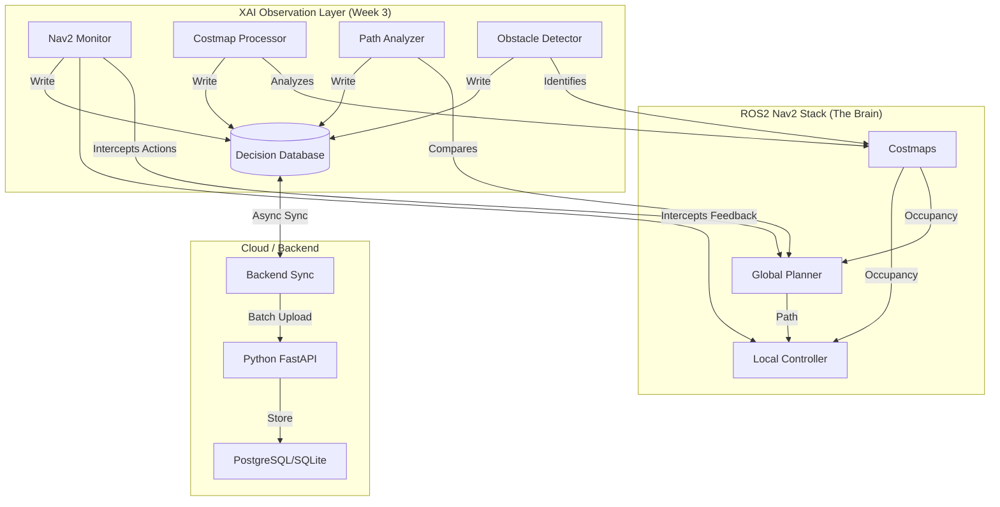

# Week 3: Intelligent Navigation & Data Capture
## The "Nervous System" of the Digital Twin

**Duration:** 7 Days (Feb 3 - Feb 9, 2025)
**Objective:** Engineer the decision-making and data-capture layer of the robot. This is not just about "logging"; it is about creating a high-fidelity **Digital Record** of the robot's cognitive state to enable Explainable AI (XAI) and Anomaly Detection.

---

## 1. Strategic Context

We are building an **Intelligent Digital Twin**. For a twin to be "intelligent," it must understand *why* the physical robot acted the way it did.
*   **Week 1 & 2** gave us a voice and a memory.
*   **Week 3** gives us **self-awareness**.

We are moving beyond simple "A to B" navigation. We are intercepting the robot's internal monologue (Nav2 planner, costmaps, sensors) and structuring it into a queryable database. This data will fuel the **Gemini LLM** (Week 4) to generate natural language explanations like *"I detoured because I saw a dynamic obstacle in the hallway."*

### Success Criteria (The "Apple Standard")
1.  **Zero-Latency Impact:** Logging must occur asynchronously. The robot's navigation performance (Hz) must not degrade.
2.  **Rich Context:** Every decision log must include the *state of the world* (costmap snapshot, robot pose, active goal) at that exact millisecond.
3.  **Resilience:** The system must handle network partitions (offline mode) and sync data to the backend when connectivity is restored without data loss.
4.  **Queryable History:** We must be able to reconstruct the robot's entire path and logic flow from the database alone.

---

## 2. System Architecture

We are injecting an **Observation Layer** into the standard ROS2 Nav2 stack.



---

## 3. Implementation Roadmap

### Day 1: The Observer (Nav2 Monitor)
**Goal:** Intercept navigation intents without disrupting them.
*   **Concept:** The `Nav2Monitor` is a wrapper around the `NavigateToPose` action client. It acts as a "Man-in-the-Middle" for logging.
*   **Key Deliverable:** `nav2_monitor.py`
*   **Robustness Check:**
    *   Does it handle Action Server restarts?
    *   Does it capture `GoalStatus.ABORTED` vs `CANCELED` correctly?
    *   **Requirement:** Log the *initial* global plan as soon as it's computed.

### Day 2: The Memory (Decision Database)
**Goal:** High-performance local storage.
*   **Concept:** A local SQLite database running in WAL (Write-Ahead Log) mode for high concurrency. This is the "Black Box" flight recorder.
*   **Schema:**
    *   `navigation_decisions`: The "Event" (e.g., Path Blocked).
    *   `system_state`: Snapshot of battery, wifi, cpu (for Anomaly Detection).
    *   `costmap_snapshots`: Compressed representation of the local grid (critical for XAI).
*   **Key Deliverable:** `decision_database.py`
*   **Robustness Check:**
    *   Use `sqlite3` with `check_same_thread=False` (carefully) or use `aiosqlite` for async I/O.
    *   Implement auto-pruning (keep last 7 days) to prevent disk saturation.

### Day 3: The Analyst (Path & Obstacle Analysis)
**Goal:** Turn raw data into *insight*.
*   **Concept:**
    *   **Path Analyzer:** Don't just log the path. Log the *deviation*. If the robot deviates >0.5m from the global plan, *that* is an event. Why did it happen?
    *   **Obstacle Detector:** Scan the local costmap along the trajectory. If lethal costs appear, log an "Obstacle Event" with the distance and size.
*   **Key Deliverables:** `path_analyzer.py`, `obstacle_detector.py`
*   **XAI Prep:** These modules generate the *prompts* for Gemini. E.g., "Obstacle detected at 2m" -> "I saw a box in front of me."

### Day 4: The Bridge (Backend Sync)
**Goal:** Telemetry and Dashboard integration.
*   **Concept:** A background thread that wakes up every 5 seconds, checks for unsynced records in SQLite, and POSTs them to the FastAPI backend.
*   **Key Deliverable:** `backend_sync.py`
*   **Robustness Check:**
    *   **Batching:** Send 50 records at a time, not 1 by 1.
    *   **Idempotency:** Ensure the backend handles duplicate uploads gracefully.
    *   **Retry Logic:** Exponential backoff if the server is down.

### Day 5-7: Integration & "The Stress Test"
**Goal:** Verify the system under pressure.
*   **Simulation:** Run the robot in Gazebo. Spawn dynamic obstacles (people/boxes).
*   **Verification:**
    1.  Does the database show the *exact* moment the robot stopped for the obstacle?
    2.  Is the latency < 100ms?
    3.  Kill the backend server. Does the robot keep logging locally? Restart the backend. Does it sync?

---

## 4. Technical Specifications

### 4.1 Database Schema (Enhanced)

```sql
-- The Core Event Log
CREATE TABLE navigation_decisions (
    id INTEGER PRIMARY KEY AUTOINCREMENT,
    session_id TEXT NOT NULL,
    timestamp REAL NOT NULL,
    event_type TEXT NOT NULL, -- 'GOAL_SENT', 'PATH_DEVIATION', 'OBSTACLE_STOP', 'GOAL_REACHED'
    
    -- Spatial Context
    pose_x REAL,
    pose_y REAL,
    pose_theta REAL,
    
    -- Navigation Context
    goal_x REAL,
    goal_y REAL,
    
    -- XAI Data
    nearest_obstacle_dist REAL,
    active_behavior TEXT, -- 'follow_path', 'recovery', 'spin'
    
    -- Sync Status
    synced BOOLEAN DEFAULT 0
);

-- For Anomaly Detection (High Frequency 1Hz)
CREATE TABLE telemetry_snapshots (
    id INTEGER PRIMARY KEY AUTOINCREMENT,
    timestamp REAL NOT NULL,
    battery_voltage REAL,
    cpu_usage REAL,
    wifi_signal REAL,
    motor_currents_json TEXT -- JSON array of currents
);
```

### 4.2 API Contract (Sync)

**POST** `/api/v1/telemetry/sync`
```json
{
  "session_id": "uuid-1234",
  "records": [
    {
      "id": 45,
      "timestamp": 1707123456.78,
      "event_type": "OBSTACLE_STOP",
      "data": { ... }
    }
  ]
}
```
**Response:**
```json
{
  "status": "success",
  "processed_ids": [45]
}
```
*Note: The client (robot) only marks records as `synced=1` after receiving the `processed_ids` confirmation.*

---

## 5. "Apple-Style" Implementation Notes

*   **No "Magic Numbers":** All thresholds (obstacle distance, deviation tolerance) must be in `xai_params.yaml`.
*   **Structured Logging:** Use `rclpy.logging` properly. Don't use `print()`.
*   **Type Hinting:** All Python code must be fully type-hinted (`def foo(x: int) -> bool:`).
*   **Unit Tests:** You cannot deploy what you cannot test. Write tests for the `DecisionDatabase` class first.

## 6. Next Steps (Transition to Week 4)
Once this "Nervous System" is active, Week 4 will simply be about connecting the "Voice" (Gemini) to these "Nerves." We will query this database to generate the explanations.

**Go forth and build.**
